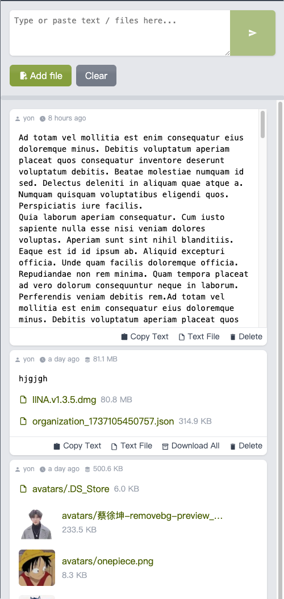

<p align="center"></p>
<h1 align="center">cf-drop</h1>
<p align="center">🗃️ Private File/Text Box — Deploy on Cloudflare Workers</p>


<table width="100%">
<tr>
<td>

</td>
<td>
<ul>
<li>⚡ <strong>Serverless</strong> on Cloudflare Worker</li>
<li>📱 <strong>PWA ready!</strong> for mobile</li>
<li>🔑 <strong>Password protected</strong></li>
<li>📦 <strong>Download</strong> as Tarball</li>
<li>🚚 <strong>Resumable download link</strong></li>
<li>🔗 <strong>Shareable download link</strong></li>
</ul>
</td>
</tr>
</table>

## 🚀 Quick Start

Follow these steps to get up and running quickly:

(Prerequisites: Node.js >= 20, pnpm)

```sh
pnpm install

npx wrangler r2 bucket create cf-drop
npx wrangler d1 create cf-drop

# 📝 edit wrangler.toml
# 1. write down the database_id
# 2. set the password

# then...
npm run deploy
```

## 🎨 Customize

Make `cf-drop` your own by customizing the following:

- 🔑 **Set password** via `./wrangler.toml`
- 🎨 **Change theme color** in `./web/public/manifest.json`
- 💡 **Find `database_id`** from Cloudflare Dashboard - D1 SQL page
- **Development** - `pnpm dev`
